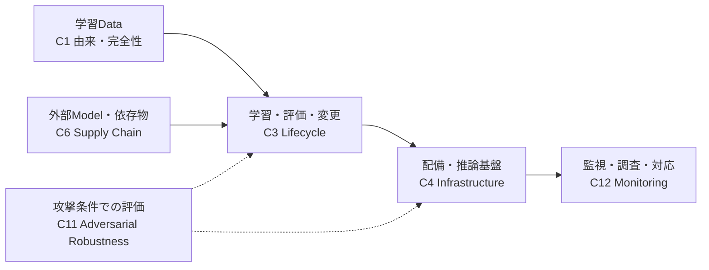
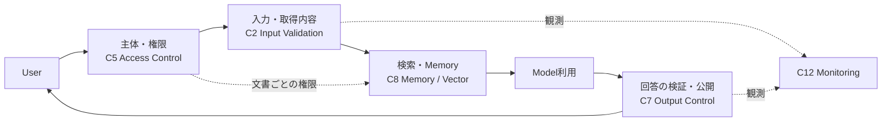
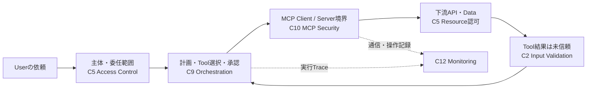

# AISVS Familyはシステムのどこに効くか

AISVS v1.0の12 Familyを、代表的な三つの構成に重ねた見取り図。
各枠は「そこで何を保証するか」の入口であり、要件の網羅図、製品の適合判定、
Engineering PatternとのMappingではない。同じFamilyが複数の場所に効き、
実際の適用範囲は個別Requirementと製品の構成から判断する。
名称・番号は[固定版AISVS](https://github.com/OWASP/AISVS/tree/78775233666a2022dcfb82037e5e029116955c00/1.0/en)に基づく。

## 1. Modelを作り、受け入れ、稼働させる

この図で問うのは、DataやArtifactを信頼できる由来から受け取り、
変更を評価してから安全な環境へ配備し、攻撃条件での弱さや運用中の異常を
見逃さないか、ということ。C11は製造工程の末尾だけでなく、変更後・運用中の
評価にも関わる。C12の監視も推論基盤だけに限定されない。

## 2. Userの質問からRAG回答まで

ここでは「質問を受け付けた」ことと「その文書を読んでよい」ことを分ける。
検索前・検索後の権限、取得内容の未信頼性、Model出力の公開判定は別の境界である。
C2で入力を検査してもC7の出力検査を省けず、C7の出力検査でC5の認可を代替できない。

## 3. AgentがMCP経由で外部Resourceを操作する

C9はAgentの行動・権限・停止可能性、C10はMCPを跨ぐ認証・認可・Tool/Resourceの
信頼境界を問う。MCP Serverが認証済みでも、下流Resourceへの操作が許可された
ことにはならない。Tool結果を再びAgentに渡す時も、外部入力として扱う。

三つの図はFamilyの典型的な効き所を示すだけであり、ひとつの構成で全12 Familyが
必ず適用されるという意味ではない。個別の「問うこと」と「できてはいけないこと」は
[Family別Control案内](README.md)から、正確な要件はAISVS原文から確認する。
